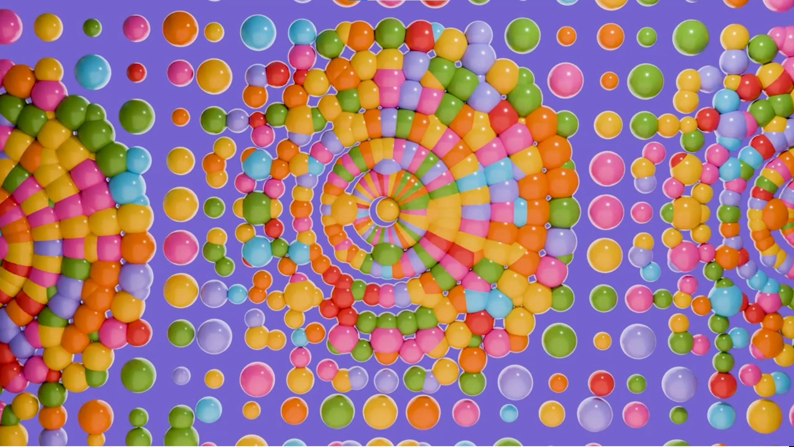

# 🎨 Op Art Animation in Blender with Python 🌀  

  

## 🎭 Exploring Creative Chaos in Technical Art  

This project is an experimental dive into **Op Art (Optical Art)**, a mesmerizing artistic movement that gained popularity in the 20th century. Op Art plays with visual perception through geometric patterns, contrasts, and movement illusions. But what if we mix this **artistic anarchy** with modern tools like **Blender** and **ChatGPT**? 🤯  

## 🚀 The Idea  

I asked **ChatGPT** to generate a **Python script** that creates an Op Art-style animation in **Blender**. The goal? To explore how **creative coding** can enhance artistic expression using procedural techniques.  

With **just a script and Blender**, I generated a **dynamic, colorful, and hypnotic animation**—a blend of **math, code, and artistic inspiration**. This experiment highlights how **free** tools like Blender and AI-powered assistants can **democratize technical art** and push creative boundaries. 🎨💻  

## ✨ Why is this cool?  

- 🏗️ **Combines technical and artistic skills**  
- 🎨 **Plays with color, motion, and perception**  
- 💡 **Explores creative possibilities of AI-generated code**  
- 🎭 **Revisits a classic art movement with modern tools**  

## 🔥 Try it yourself!  

1. Open **Blender** (it's free! 🎉)  
2. Copy-paste the Python script into the **Scripting** editor  
3. Run it and watch the **magic unfold!** 🌀✨  

### 💬 Final Thoughts  

This is just the beginning of a **fun and limitless journey** in **Technical Art**. Let’s keep experimenting, breaking rules, and creating **awesome visual illusions**! 🚀🎭  

